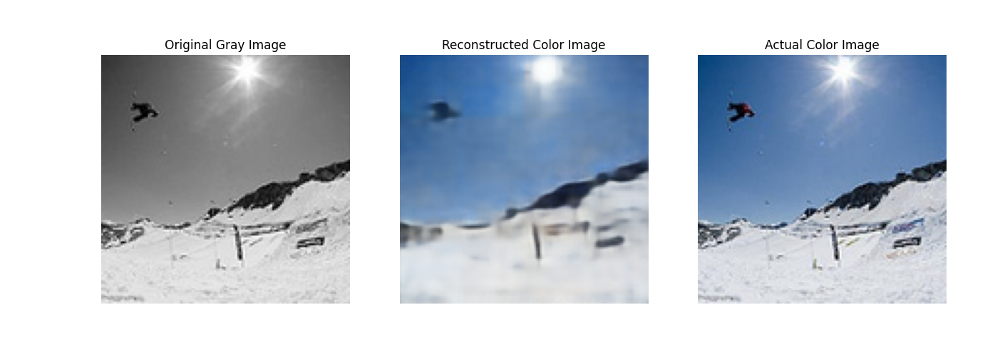
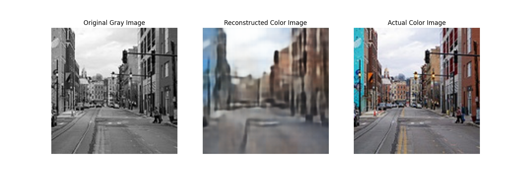

# Image AutoEncoders

Image autoencoder to colorize grayscale images. The vanilla autoencoder does a relatively good job of reconstructing images.

The vanilla encoder is esentially a nonlinear dimensional reduction tool (unlike PCA) while the decoder acts as the key to reconstruct the original signal.

This project is interesting because the reconstruction is not just the original image which means that the encoder and decoder are not only working to reduce the dimensionality \\ 
of the original input. 

The encoder is built through a layer of convolutional neural networks with batch normalization. Ideally, skip connections would be implemented in the future for \\
tackling the vanishing gradient problem, but the results seem fine without it.

I trained on 50 epochs with a lr of 0.0005 on a 3050Ti.

Here are some results I obtained:

 \\

The VAE is still a work in progress (both in terms of training and understanding).

Image data was obtained from here: https://www.kaggle.com/datasets/theblackmamba31/landscape-image-colorization