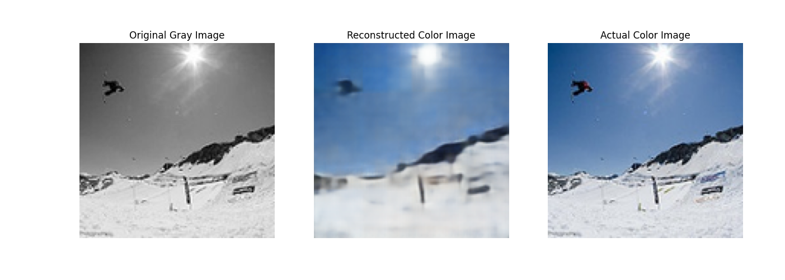
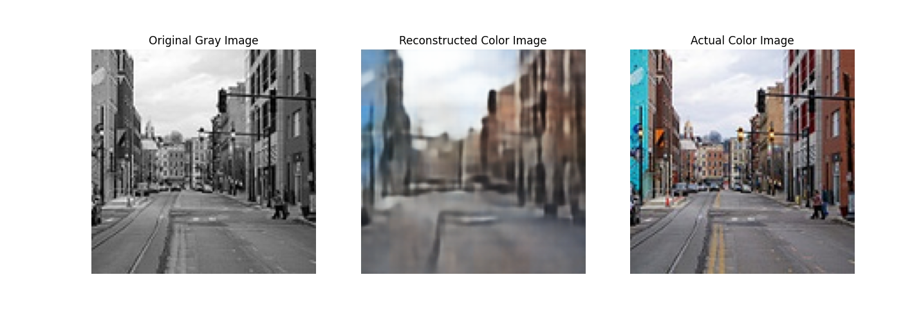

# Classical Image Autoencoder

The vanilla encoder is esentially a nonlinear dimensional reduction tool (unlike PCA) while the decoder acts as the key to reconstruct the original signal.

The encoder is built through a layer of convolutional neural networks with batch normalization.

Here are some results I obtained:

 \\

I trained on 50 epochs with a lr of 5e-4 on a 3050Ti.