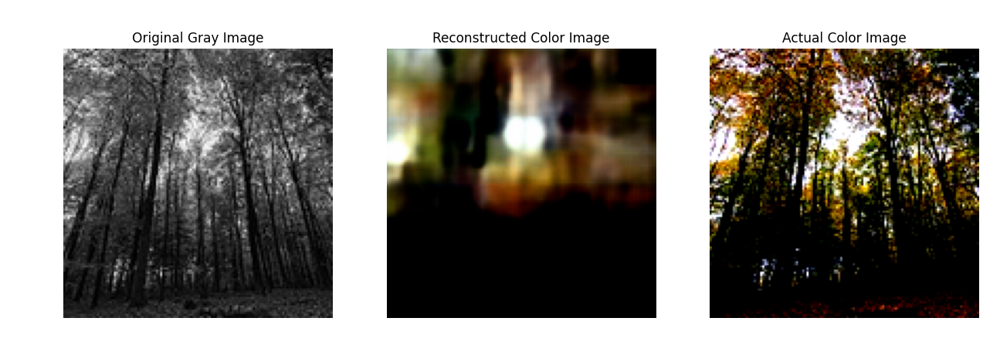
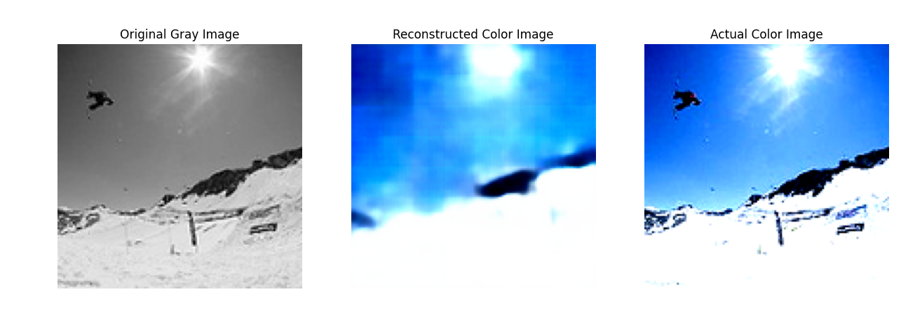
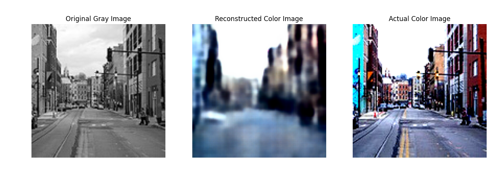

# Variational Autoencoder trained with downsampling-upsampling (no connections)

The variational autoencoder is a downsampling tool that allows for better dimensional reduction because features are mapped into a continous space so image generation can occur from sampling.

Though that's not the primary goal of this task, that is an interetsing tidbit to take away.

The results for the VAE wasn't great, but that could be due to a lack fo training time.

I trained on 50 epochs with a lr of 5e-4 and a latent dimension of 256. Training was conducted on a Nvidia 3050-Ti.