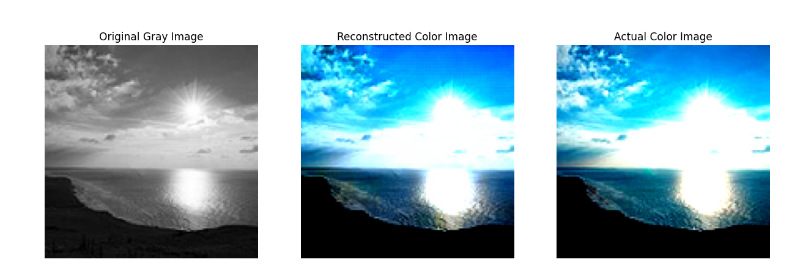
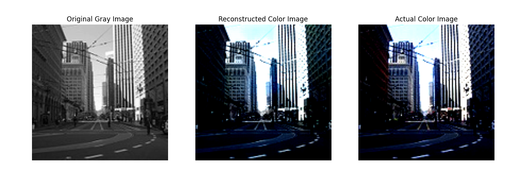
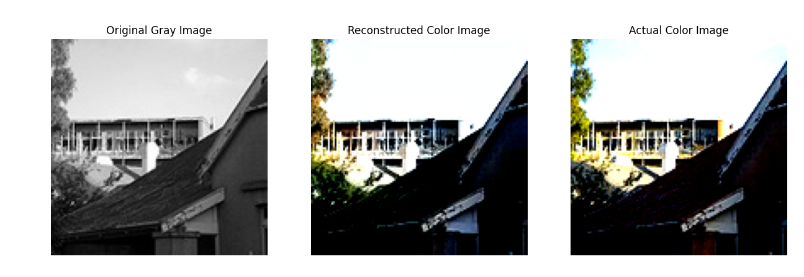

# Autoencoder Trained on UNET

Instead of a classical encoder-decoder structure, this architecture uses skip connections from previous opposing layers that are oppositely connected and concatenated.

Reconstruction results are much better than the no-skip VAE, but more training time was given. Unlike its sister algorithm (the no-skip VAE), the UNET VAE can't be used for
image generation tasks because of the lack of skip connections in the encoder architecture and is better suited for prediction-based tasks.

Results were very good for reconstruction.

